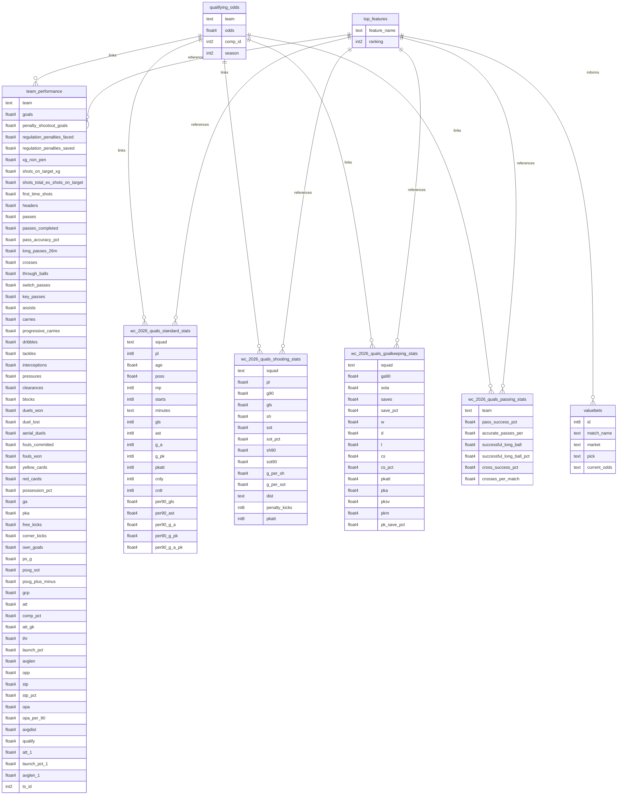

# Sports Betting Companion

## Database Design

### Overview
Sports Betting Companion is a data-driven tool that helps users find undervalued soccer bets using historical data and live sportsbook odds. With the 2026 World Cup coming to the US, many new bettors may not know much about the teams or players. Our goal is to make it easier for them to make smarter, data-backed bets. By connecting historical performance data with sportsbook odds, users can identify which teams are statistically undervalued compared to their betting lines.

### Entity Relationship Diagram

    

### Tables Description

**qualifying_odds**
Stores pre-tournament or pre-match betting odds for teams in World Cup qualification competitions.
This table acts as the central reference point for probabilistic expectations and is used to join all performance datasets by team, competition, and season. It is especially useful as a target or contextual feature source for predictive modeling.

**team_performance**
Contains a comprehensive, team-level performance profile covering attacking, defensive, possession, passing, dueling, and goalkeeping-adjacent metrics.
This table aggregates advanced match actions (xG, pressures, progressive carries, duels, passing types, GK distribution) and is designed to serve as a high-dimensional feature table for team strength evaluation and qualification modeling.

**wc_2026_quals_standard_stats**
Holds traditional team statistics from 2026 World Cup qualification matches, including appearances, minutes, goals, assists, cards, and per-90 rates.
This table provides a baseline statistical view of team output and discipline, making it useful for sanity checks, historical comparisons, and lower-complexity models.

**wc_2026_quals_shooting_stats**
Focuses specifically on shooting volume, efficiency, and shot quality at the team level.
Metrics such as shots, shots on target, shot distance, and conversion ratios allow deeper analysis of chance creation vs finishing efficiency, complementing xG-based features in other tables.

**wc_2026_quals_goalkeeping_stats**
Captures team-level goalkeeping outcomes, including goals allowed per 90, shots on target faced, saves, clean sheets, and penalty performance.
This table isolates the defensive end-state of matches, helping distinguish between poor defending and elite goalkeeping in conceded-goal outcomes.

**wc_2026_quals_passing_stats**
Provides passing efficiency and distribution metrics, including overall pass success, long-ball effectiveness, crossing accuracy, and volume per match.
This table is useful for identifying stylistic differences between teams (possession-based vs direct play) and for augmenting tactical or clustering analyses.

**top_features**
Stores the ranked feature outputs from a model or feature-selection process.
Each row represents a single feature used in analysis or modeling, along with its relative importance or ranking. This table acts as a bridge between raw performance data and decision-making layers, enabling transparency into which statistics most strongly influence predictions, odds evaluation, or betting logic.
Typical use cases
Feature importance tracking for ML models
Model explainability and auditability
Driving downstream logic (e.g., weighting bets or filtering metrics)
Versioning which features matter across seasons or competitions

**valuebets**
Contains identified betting opportunities where market odds differ from model-implied probabilities.
Each row represents a specific match, market, and pick, paired with the current available odds. This table operationalizes model outputs into actionable betting insights, making it the final consumer-facing or decision-support layer of the system.

Typical use cases
Surfacing high-value betting picks
Monitoring market movement vs model confidence
Powering dashboards or alerts
Backtesting betting strategies over time

using (

# Sports Betting Companion API

### Setup Instructions
- pip install supabase
- python test_connection.py
- python db_tests.py

### Prerequisites
- Python 3.10+
- Supabase account

## Machine Learning Logic

Used three different classification models: Logistic Regression, RandomForestClassifier, and Gradient Boosting. We used classification models because we had a categorical target feature, whether a team qualified(1) or didn't qualify(0). We used historical data from the 2022 World Cup and 2024 Euros to train and test. We used offensive, passing, and goalkeeping stats and averaged them across the number of games a team played in that tournament. With that, we fed the CSV into the different ML Models, using a 70%-30% train/test split because of our limited dataset; much of the data was unavailable due to excessive financial costs. From these models, we evaluated their success by their ROC_auc and accuracy scores. Random Forest had the highest ROC_auc at.764 Then, we examined the feature importances for each model and identified key features, including Shots on Target per 90 minutes, success_long_ball_pct, Goals Allowed, Post Shot Expected Goals, Possession, Passes Completed, and Pass_Success_pct. Because we did not have access to premium API subscriptions, we manually found equivalent statistics. We evaulated teams with high rankings in these statistics relative to their odds that were released on December 5th, then tagged them as undervalued. With more resources we will make a more complex formula to evaluate how much these teams are undervalued and how much you should bet on them. 
