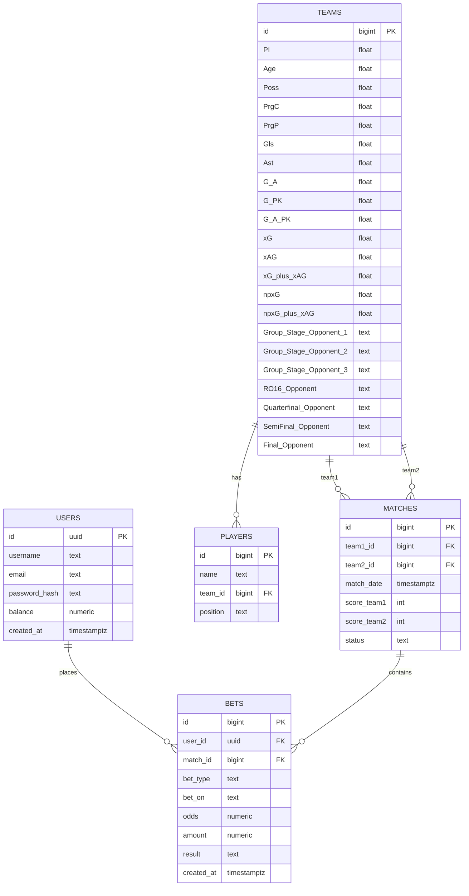

# Sports Betting Companion

## Database Design

### Overview
Sports Betting Companion is a data-driven tool that helps users find undervalued soccer bets using historical data and live sportsbook odds. With the 2026 World Cup coming to the US, many new bettors may not know much about the teams or players. Our goal is to make it easier for them to make smarter, data-backed bets. By connecting historical performance data with sportsbook odds, users can identify which teams are statistically undervalued compared to their betting lines.

### Entity Relationship Diagram

### Tables Description

#### 1) `users`
Stores user information and account balance.
- `id` (UUID, PK)  
- `username` (TEXT)  
- `email` (TEXT, unique)  
- `password_hash` (TEXT)  
- `balance` (NUMERIC) – user’s account balance  
- `created_at` (TIMESTAMPTZ, default now)

#### 2) `teams`
Represents each national team.
- `id` (BIGINT, PK)  
- '#Pl' float -Players Used
- Age, float -Average Age of players used
- Possession, float -Average Possession for team throughout tournament
- PrgC, float - Progressive Passes Completed
- ProP, float - Progressive Passes Attempted
- Goals, float - Goals Scored
- Ast, float- Assists
- G + A, float, Goals + Assists
- G + A - PK, float - Goals not including penalty kicks
- xG, float - Expected Goals
- xAG, float - Expected Goals Against
- xG - xAG, float - Difference between Expected Goals and Excepted Goals against
- Group_Stage_Opponent_1, text -Name of the first opponent the team faces during the group stage of a tournament.
- Group_Stage_Opponent_2, text -Name of the second opponent in the group stage.
- Group_Stage_Opponent_3, text -Name of the third opponent in the group stage.
- RO16_Opponent, text -The opponent team the club/nation plays in the Round of 16 (knockout phase).
- Quarterfinal_Opponent, text -The opposing team in the Quarter-Final round, if the team advances that far.
- Column	Data Type	Explanation
Group_Stage_Opponent_1	text	Name of the first opponent the team faces during the group stage of a tournament.
Group_Stage_Opponent_2	text	Name of the second opponent in the group stage.
Group_Stage_Opponent_3	text	Name of the third opponent in the group stage.
RO16_Opponent	text	The opponent team the club/nation plays in the Round of 16 (knockout phase).
Quarterfinal_Opponent	text -The opposing team in the Quarter-Final round, if the team advances that far.
SemiFinal_Opponent, text	-The opponent faced in the Semi-Final stage of the tournament.
Final_Opponent, text -The final match opponent if the team reaches the championship game.

#### 3) `players`
Links individual players to their team.
- `id` (BIGINT, PK)  
- `name` (TEXT)  
- `team_id` (BIGINT, FK → teams.id)  
- `position` (TEXT)

#### 4) `matches`
Stores match information and outcomes.
- `id` (BIGINT, PK)  
- `team1_id` (BIGINT, FK → teams.id)  
- `team2_id` (BIGINT, FK → teams.id)  
- `match_date` (TIMESTAMPTZ)  
- `score_team1` (INT)  
- `score_team2` (INT)  
- `status` (TEXT: scheduled, in_progress, finished)  
- `stage` (TEXT) – tournament stage (Group, R16, etc.)  
- `venue` (TEXT)  
- `api_ref` (TEXT) – optional external reference

#### 5) `bets`
Tracks bets users place on matches.
- `id` (BIGINT, PK)  
- `user_id` (UUID, FK → users.id)  
- `match_id` (BIGINT, FK → matches.id)  
- `bet_type` (TEXT) – e.g., moneyline, spread, total  
- `bet_on` (TEXT) – team or outcome bet on  
- `odds` (NUMERIC) – American odds  
- `amount` (NUMERIC) – wagered amount  
- `result` (TEXT: pending, won, lost, void)  
- `created_at` (TIMESTAMPTZ, default now)

### Security Model
We use **Row Level Security (RLS)** to ensure that users can only view and modify their own data.  
- Only authenticated users can add or view their personalized bet analyses.
- Furthermore, for data privacy reasons, we restrict the Bets and Users tables to respect the users that use our product.
- Code: alter policy "Enable read access for all users"
2
on "public"."matches"
5
to public
6
using (

# Sports Betting Companion API

## What it does
Getting information from the database and print it out

## Setup
1. `pip install -r requirements.txt`
2. Add `.env` with Supabase credentials
3. `uvicorn main:app --reload`
4. Test at http://localhost:8000/docs

## Endpoints (at a minimum)
- `GET /[entity]` - List all
- `POST /[entity]` - Create new
- `POST /[action_1]` - [Business logic description]
- `POST /[action_2]` - [Business logic description]
- `POST /[action_3]` - [Business logic description]

## Key Business Rule
[Explain your business logic endpoints in 2-3 sentences]

### Setup Instructions
- pip install supabase
- python test_connection.py
- python db_tests.py

### Prerequisites
- Python 3.10+
- Supabase account
